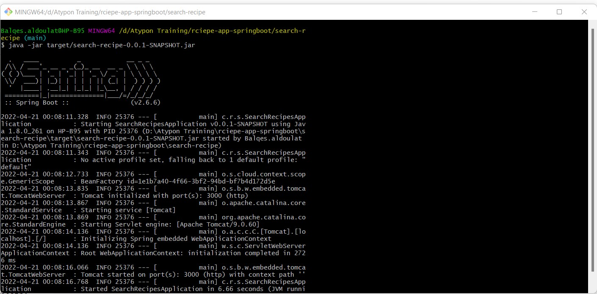

# Project Title: Recipes Explorer :grinning:
# Summary
**This application provides the ability to search recipes and provides recipes information. it includes backend endpoints implemented with spring boot.**

# Application setup
**First thing you have to do open the properties file and upadte apiKey value, file name [application.yml]. then you can follow one of the approaches explained below.**

## First Approach-Using IDE

**After downloading the project then open the project by using any IDE you prefer (IntelliJ, STS, ...etc), 
Then you can run the application by running the java class file with the name "SearchRecipesApplication" which is the starting point of spring application.**

## Second Approach-Using command line

**Follow the below steps:**
```
**This steps work with windows operating system**
1. You have to dowload JAVA jdk.
2. Set the Environment variable JAVA_HOME, check this[link](https://mkyong.com/java/how-to-set-java_home-on-windows-10/).
3. installing Apache Maven and adding the bin folder with the mvn command to the PATH, check this [link] (https://maven.apache.org/install.html).
4. Then from the command line move to ..\rciepe-app-springboot\search-recipe, keep in mind to replace ".." with the path where you save the project.
5. Then from the command line run this command [ mvn install]
6. after completing step 5 run this command [java -jar target\search-recipe-0.0.1-SNAPSHOT.jar]
```


# Design decisions
I would like to highlit why I have chosen Open Fien instead of RestTemplate, The Point is that using Open Fien helped me to implement the concept of abstraction so I separated the logic of calling endpoints from the rest controller's implementation as well avoiding redundant code.

Another thing creating different packages of DTO one to receive the response object from spectacular and the other for my application 
and the point here is to make the code maintainable and to avoid high coupling classes. 

I write a separate test class for each endpoint and here I followed the concept of the single responsibility principle.


# Application end points:

**Serch for recipe**
* Takes the below as parameters:
```
1. title
2. cuisine 
3. excludeCuisine
```
Http-method: GET, sample example: http://localhost:3000/recipes?title=burger&cuisine=italian&excludeCuisine=greek

**get recipe information:**
* Takes the below as parameters:
```
1. name
2. id 
```
Http-method: GET,sample example: http://localhost:3000/recipes/ingredients?name=Italian%20Tuna%20Pasta&id=715538

**get customized recipe information:**
* Takes the below as parameters:
```
1. name
2. excludedIngredients 
3. id 
```
Http-method: GET, sample example: http://localhost:3000/recipes/ingredients/custom?name=Italian%20Tuna%20Pasta&id=715538&excludedIngredients=10010062,20420,1033

# Swagger documentation:
You can visit swagger to get full endpoints documentation [visit swagger](http://localhost:3000/swagger-ui.html).

# Postman collection
Here is a public link to a static snapshot of  collection contains application Api's
**[collection snapshot](https://www.getpostman.com/collections/04da810982f8da552de3)**

# Spring Api's used to implement this application 
* spring boot web
* lombok
* spring cloud openfeign
* springfox swagger2/swaggerUi

# Unit testing 
**I tested each endpoint by passing valid and invalid input, and the test was passed for all test cases.**


