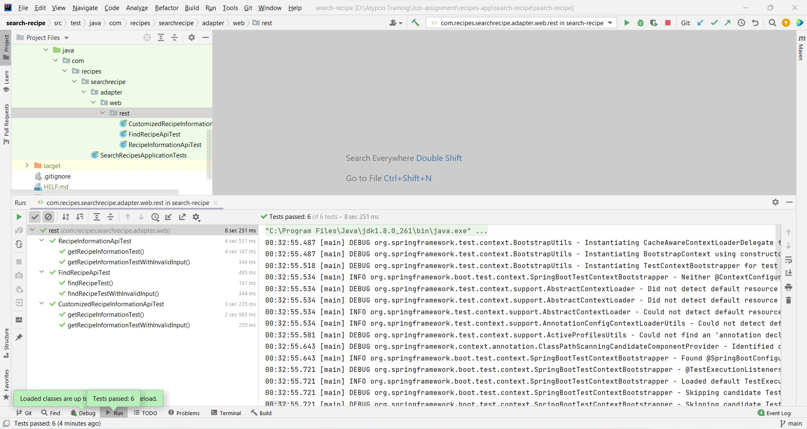

# Project Title: Recipes Explorer :grinning:
# Summary
**This application provides the ability to search recipes and provides recipes information. it includes backend endpoints implemented with spring boot.**

# Application setup
**After cloning the project and by using any IDE you prefer (IntelliJ, STS, ...etc) or by running the application using the command line, 
then you can lunch the application by running the file with the name "SearchRecipesApplication.java as starting point.**

# Application end points:

**Serch for recipe**
* Takes the below as parameters:
```
1. title
2. cuisine 
3. excludeCuisine
```
**Http-method: GET, sample example: http://localhost:3000/recipes?title=burger&cuisine=italian&excludeCuisine=greek**

**get recipe information:**
* Takes the below as parameters:
```
1. name
2. id 
```
**Http-method: GET,sample example: http://localhost:3000/recipes/ingredients?name=Italian%20Tuna%20Pasta&id=715538**

**get customized recipe information:**
* Takes the below as parameters:
```
1. name
2. id 
```
**Http-method: GET, sample example: http://localhost:3000/recipes/ingredients/custom?id=715538&excludedIngredients=10010062,20420,1033**

# Swagger documentation:
**You can use swagger to get full endpoints documentation [visit swagger](http://localhost:3000/swagger-ui.html).**

# Spring Api's used to implement this application 
* spring boot web
* lombok
* spring cloud openfeign
* springfox swagger2/swaggerUi

# Unit testing 
**I tested each endpoint by passing valid and invalid input, and the test was passed for all test cases.**

